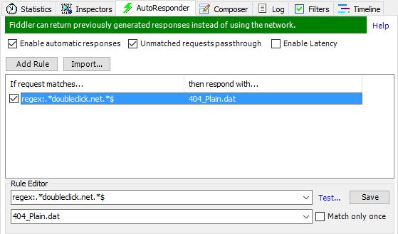

Fiddler has some really powerful tools for aiding development and assisting with
debugging. One of these features is the AutoResponder tab:

{width=559 height=329}

When writing integration tests, you may need to set up a scenario to test the application
in a given state based on different responses from external systems. The following class
shows an example of how you can intercept requests and respond with a 404 response if
the request is to a known advertising domain:

```csharp
public static class BlockTrackingWebsiteRequestsContext
{
    private static IEnumerable<string> BlockedDomains
    {
        get
        {
            return new[]
            {
                "flx1.com",
                "mmtro.com",
                "liverail.com",
                "adform.net",
                "t.co",
                "pubmatic.com",
                "doubleclick.net"
            };
        }
    }

    public static void SetupBlockTrackingWebsiteRequests()
    {
        FiddlerApplication.BeforeRequest += ConfigureBlockTrackingWebsiteRequestsDelegate;
    }

    public static void TearDownBlockTrackingWebsiteRequests()
    {
        FiddlerApplication.BeforeRequest -= ConfigureBlockTrackingWebsiteRequestsDelegate;
    }

    private static void ConfigureBlockTrackingWebsiteRequestsDelegate(Session targetSession)
    {
        if (BlockedDomains.Any(targetSession.uriContains))
        {
            targetSession.oRequest.FailSession(404, "Blocked", "Fiddler blacklisted this domain");
        }
    }
}
```

To register this functionality within your test, reference this class in the *SetUp*
and *TearDown* methods to your test as follows. It is important to remember to deregister
the code at the end of your test so that it doesn't affect any future tests in your test
fixture.

```csharp
[SetUp]
public void SetUp()
{
    BlockTrackingWebsiteRequestsContext.SetupBlockTrackingWebsiteRequests();
}

[TearDown]
public void TearDown()
{
    BlockTrackingWebsiteRequestsContext.TearDownBlockTrackingWebsiteRequests();
}
```
