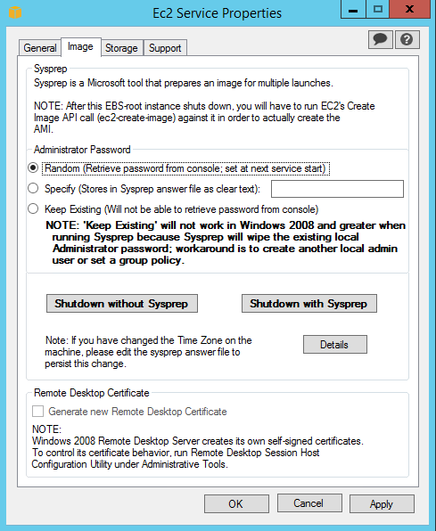

When working with AWS EC2, it's always good practice to create an AMI of your instance
whether it is for DR purposes or for a reference point to spin up new instances using
CloudFormation. By default, when you launch an instance from your custom Windows AMI,
you will see the following message when trying to retrieve the administrator password
in the AWS console:

> Password is not available.

> The instance was launched from a custom AMI, or the default password has changed. A
password cannot be retrieved for this instance. If you have forgotten your password,
you can reset it using the Amazon EC2 configuration service. For more information, see
[Passwords for a Windows Server instance](https://docs.aws.amazon.com/console/ec2/instances/connect/windows-password).

If you no longer have the administrator password for the instance from the original instance, then you have to follow this [long process](http://docs.aws.amazon.com/AWSEC2/latest/WindowsGuide/ec2-windows-passwords.html#ResettingAdminPassword).

To avoid having to run through this process, you can create your AMI so that it generates
a new random password each time an instance is created and also enable the password to be
retrieved from the EC2 console. To do this, configure the EC2Config service as follows:

1. Remote desktop to your Windows instance and open the EC2Config Service.
2. Click the *Image* tab and then under *Administrator Password* click *Random*.
3. Click *Shutdown with Sysprep* and wait for the instance to become *Stopped*.
4. Once the instance is stopped, create your AMI as normal.

{width=489 height=596}

The next time you create an EC2 instance from this AMI, you will be able to retrieve
the Administrator password from the console as normal rather than getting the error
message above.
