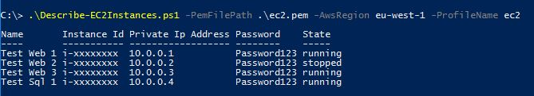

When using EC2, I find it a laborious process to log in to the AWS console and
retrieve all of the information required to remote desktop to an instance and
then even more clicks to retrieve the administrator password. If you have created
N instances using something like CloudFormation, then this time increases by N times
depending on the number of instances you want to access.

The script at the end of this article retrieves all of the common information you
need about your EC2 instances with just one command as well as decrypting all of
the passwords saving a lot of time and effort. All that is required to run it
is the [AWS Tools for Powershell](https://aws.amazon.com/powershell/) and the PEM
file the instances were assigned to so that the password can be decrypted.

Here is an example of the output you will get:

{width=669 height=121}

And the script to generate it:

```powershell
Param (
  [Parameter(Mandatory=$true)][string]$PemFilePath,
  [Parameter(Mandatory=$true)][string]$AwsRegion,
  [string]$AwsAccessKey,
  [string]$AwsSecretyKey,
  [string]$ProfileName
)

Function Describe-Instance
{
  Param([Parameter(ValueFromPipeline=$true)][Amazon.EC2.Model.Instance]$instance)

  Process
  {
    $resolvedPemFilePath = Resolve-Path $PemFilePath

    try
    {
      $password = Get-EC2PasswordData -InstanceId $instance.InstanceId `
                                      -PemFile $resolvedPemFilePath `
                                      -Region $AwsRegion `
                                      -AccessKey $AwsAccessKey `
                                      -SecretKey $AwsSecretyKey `
                                      -ProfileName $ProfileName
    }
    catch { $password = "ERROR" }

    $instanceInformation = New-Object PSObject
    Add-Member -InputObject $instanceInformation `
               -MemberType NoteProperty `
               -Name "Name" -Value ($instance.Tags | ? { $_.key -eq "Name" } `
                   | Select -expand Value)
    Add-Member -InputObject $instanceInformation `
               -MemberType NoteProperty `
               -Name "Instance Id" `
               -Value $instance.InstanceId
    Add-Member -InputObject $instanceInformation `
               -MemberType NoteProperty `
               -Name "Private Ip Address" `
               -Value $instance.PrivateIpAddress
    Add-Member -InputObject $instanceInformation `
               -MemberType NoteProperty `
               -Name Password `
               -Value $password
    Add-Member -InputObject $instanceInformation `
               -MemberType NoteProperty `
               -Name State `
               -Value $instance.State.Name

    return $instanceInformation
  }
}

Get-EC2Instance	-Region $awsRegion `
                -AccessKey $awsAccessKey -SecretKey $awsSecretyKey -ProfileName $ProfileName `
                | Select-Object -ExpandProperty instances `
                | Describe-Instance `
                | Sort-Object Name `
                | Format-Table
```

To add in the public IP address of the instance, just duplicate an *Add-Member*
entry and change the *Name* parameter and the *Value* parameter to *PublicIpAddress*.