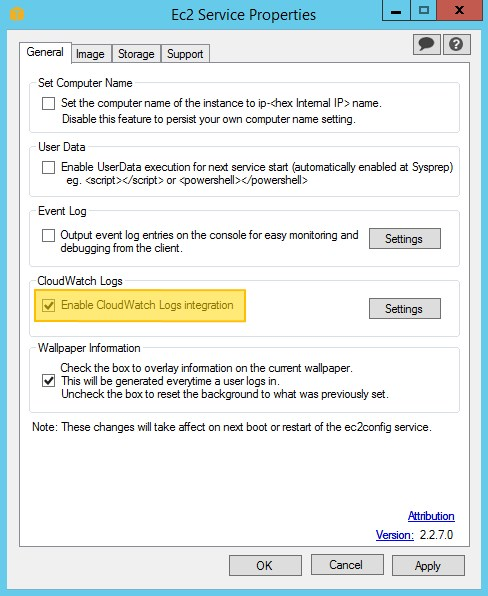
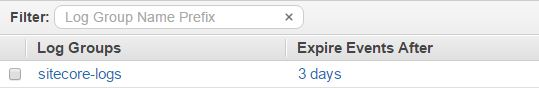
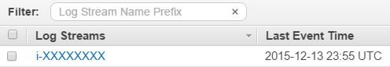
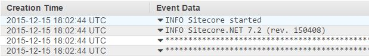

Cloud hosted infrastructure introduces the challenge of monitoring
servers on instances which will be not be around forever. Whether
instances are terminated during a blue/green deployment or during a scale
down action of an auto scaling group, log files generated by Sitecore
will be lost.

One method of shipping these logs off the server is to use *AWS CloudWatch
Logs*. AWS Windows AMIs come pre-configured with the *EC2ConfigService*
which has the functionality to sync log files to *AWS CloudWatch Logs*. 
Follow this guide to enable this with Sitecore log files:

#### **1. Update *log4net* Configuration** (Optional)

*This step is only required if you need to keep the log	files on the server in a format which the Sitecore Log Analyzer can parse.*

*CloudWatch Logs* identifies a new log entry by a time stamp, to satisfy this you must change the thread parameter (usually *%4t*) to be a fixed number so that both *CloudWatch Logs* can identify a new log entry and *Sitecore Log Analyzer* can parse successfully. See line 6 where this has been changed to *9999*:
  
```xml
<log4net>
  <appender name="LogFileAppender" type="log4net.Appender.SitecoreLogFileAppender, Sitecore.Logging">
    <file value="$(dataFolder)/logs/log.{date}.txt" />
    <appendToFile value="true" />
      <layout type="log4net.Layout.PatternLayout">
        <conversionPattern value="9999 %d{ABSOLUTE} %-5p %m%n" />
      </layout>
    <encoding value="utf-8" />
  </appender>
</log4net>
```

#### **2. Update JSON CloudWatch Logs configuration**

The *CloudWatch Logs* configuration file is located on the server in directory `C:\Program Files\Amazon\Ec2ConfigService\Settings\AWS.EC2.Windows.CloudWatch.json`. The AWS guide to ***[Configuring a Windows Instance Using the EC2Config Service](http://docs.aws.amazon.com/AWSEC2/latest/WindowsGuide/UsingConfig_WinAMI.html#send_logs_to_cwl)***	has a good introduction on how to set up pushing different types of logs to *CloudWatch Logs*, however the following	example should be a good guide to getting started with Sitecore log files:

```json
{ 
 "schemaVersion":"1.0",
 "description":"Sitecore Logs CloudWatch",
 "runtimeConfig":{ 
    "aws:cloudWatch":{ 
      "properties":{ 
        "EngineConfiguration":{ 
          "PollInterval":"00:00:15",
          "Components":[ 
            {
              "Id": "SitecoreLogs",
              "FullName": "AWS.EC2.Windows.CloudWatch.CustomLog.CustomLogInputComponent,AWS.EC2.Windows.CloudWatch",
              "Parameters": {
                "LogDirectoryPath": "C:\\inetpub\\www.contoso.com\\Data\\logs",
                "TimestampFormat": "9999 HH:mm:ss",
                "Encoding": "UTF-8",
                "Filter": "log*.txt",
                "CultureName": "en-GB",
                "TimeZoneKind": "Local",
                "LineCount": ""
              }
            },
            { 
              "Id":"CloudWatchLogs",
              "FullName":"AWS.EC2.Windows.CloudWatch.CloudWatchLogsOutput,AWS.EC2.Windows.CloudWatch",
              "Parameters":{ 
                "AccessKey": "",
                "SecretKey": "",
                "Region": "eu-west-1",
                "LogGroup": "sitecore-logs",
                "LogStream": "{instance_id}"
              }
            }
          ],
          "Flows":{ 
            "Flows":[ 
              "SitecoreLogs, CloudWatchLogs"
            ]
          }
        }
      }
    }
  }
}
```
  
Notes:

* Line 15: Matches 9999 which was defined in step 1 (if you skipped this step replace with *HH:mm:ss*)
* Line 27/28: The AccessKey/SecretKey has been left empty as this will come from the EC2 instance's IAM role (see step 3)
* Line 31: The log stream will be automatically called the same name as the EC2 instance ID
  
  
#### **3. IAM settings**

The configuration above has no values set for the *AccessKey* and 
*SecretKey*. This is because the EC2 instance's *IAM Role* 
has been set up to allow writing to *CloudWatch Logs*. If this hasn't been done, 
then an *AccessKey* and *SecretKey* with these permissions 
is required. The following is an example of the *IAM policy* that is required:

```json
{
  "Statement": [
    {
      "Resource": "*",
      "Action": [
        "logs:PutLogEvents",
        "logs:Create*",
        "logs:Describe*"
      ],
      "Effect": "Allow"
    }
  ]
}
```

#### **4. Enable CloudWatch logs**

The final step is to enable *CloudWatch Logs*. To do this, open the *EC2ConfigService*
Settings and ensure the `Enable CloudWatch Logs integration` checkbox is checked:


  
#### **5. Check results**

The easiest way to check that everything is working is to log into the AWS 
Console and navigate to *CloudWatch Logs*. Here you should see a new
*Log Group* has been created called `sitecore-logs` and within it you'll see
*Log Streams* containing log entries:


  

  

  
If it doesn't look like it's working, then check the EC2Config Service log file (`C:\Program Files\Amazon\Ec2ConfigService\Logs\Ec2ConfigLog.txt`) to see if there are any errors with your setup.

#### Analysing Sitecore Logs stored in AWS CloudWatch Logs

The next article describes how to [Analyse Sitecore Logs stored in AWS CloudWatch Logs](/analyse-sitecore-logs-in-aws-cloudwatch-logs).