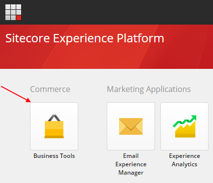
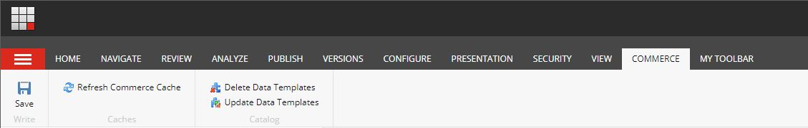
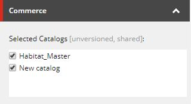

Here are some tips to help you get started after installing Sitecore Experience Commerce 9 Update-1:

1. **Commerce Business Tools**

  There's a new icon added to your launchpad which is how to navigate into the backend commerce system.

  {width=433 height=372}

2. **Commerce Business Tools runs off localhost**

  The install script (Deploy-Sitecore-Commerce.ps1) provided by Sitecore installs the Business tools to run off [https://localhost:4000/](https://localhost:4000/). There's no top-level parameter to change this. Instead, it is set in each application's SIF config file. It would be nice to see this added in future updates to Commerce to make configuring a public URL easier.

  To make Commerce Business Tools work on your public accessible host you'll need to:
  
    * Dig through the JSON configuration files of the various applications Commerce installed.
    * Update the *Link* field of the core database item
    * `/sitecore/client/Applications/Launchpad/PageSettings/Buttons/Commerce/BusinessTools`

3. **New Commerce Chunk**

  The ribbon in the Content Editor has a new Commerce chunk, this is very useful to know about (see below).

  {width=1129 height=180}

4. **Getting new categories / products to show in the content editor**

  The section of the tree `/sitecore/Commerce/Catalog Management` dynamically creates items mimicking the 
  structure of your catalog. This allows them to be used as datasources. Before new categories and products appear, 
  you need to clear the commerce cache.

  To do this, click the *Refresh Commerce Cache* button within the new *Commerce* chunk. Then refresh the tree 
  and the new items will appear.

5. **Adding a new Catalog**

  New catalogs won't show in the *Catalog Management* section of the content editor by default. To configure which
  catalogs appear, edit the *Selected Catalogs* field on the item `/sitecore/Commerce/Catalog Management/Catalogs`.

  {width=320 height=174}

6. **Searching for Product Images**

  When adding images to a product in Business Tools, the UI searches for an image in the media library. 
  If you don't know the exact name or how it is nested within sub-folders, you can use a wildcard (*) to help find the image.

  For example, `*image1*` will match `/folder/image1_01`. This is very useful as you don't need to remember the full path of
the image to find it.

7. **Control Enforce HTTPS for your Store**

  By default, SSL is enabled on your store. To configure it, update *Enforce SSL* on the store configuration item:
  `/sitecore/Commerce/Commerce Control Panel/Storefront Settings/Storefronts/YOURSTOREFRONT/Storefront Configuration`
  *Note: Replace YOURSTOREFRONT with your store name.*

 

## Future feature requests

From my brief time with Sitecore Experience Commerce 9, it would be nice to see the following features added
to make life a bit easier:

1. **More configuration parameters in the PowerShell script**
  
  For example, the URL of commerce business tools and the install directory currently need copy/pasting
  through various SIF config files. Making things more configurable at the top level PowerShell script 
  removes duplication.

2. **More interactive image search**

  Searching for images by name isn't very friendly to people managing the catalog. Having a more interactive
  search with a tree view of the media folder with previews of the images would help a lot.

3. **Category Product Search**
  
  There's currently a search at the top level of the merchandising area. It would be good to have this
  persisted at category level.