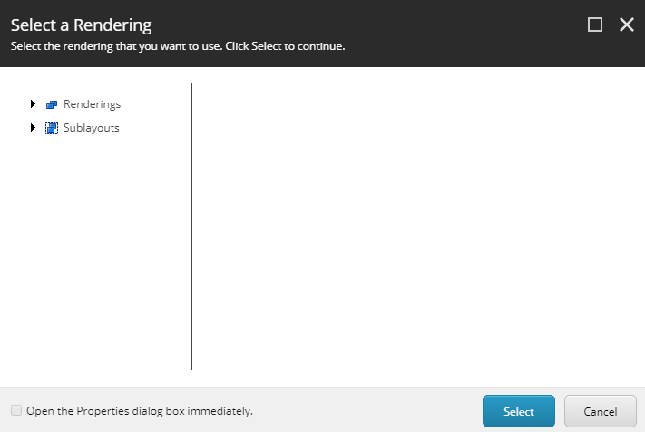

There is a compatibility issue between Vue.js and Sitecore MVC experience editor with
Sitecore 9.1. This issue is with a standard Sitecore MVC solution rather than Sitecore JSS.

## The Problem

The problem occurs when adding a new component in experience editor. The problem 
manifests itself by appearing to ignore placeholder settings and show you the treeview
for selecting a rendering:

{ height=476 width=711}

The browser then displays an alert saying "An error occurred." and the following 
in your logs:

```shell
Exception: System.InvalidOperationException
Message: placeholderKey
Source: Sitecore.ExperienceEditor
   at Sitecore.Pipelines.ExecutePageEditorAction.InsertRendering.Process(PipelineArgs args)
   at (Object , Object )
   at Sitecore.Pipelines.CorePipeline.Run(PipelineArgs args)
   at Sitecore.Pipelines.DefaultCorePipelineManager.Run(String pipelineName, PipelineArgs args, String pipelineDomain, Boolean failIfNotExists)
   at Sitecore.Pipelines.DefaultCorePipelineManager.Run(String pipelineName, PipelineArgs args, String pipelineDomain)
   at Sitecore.Pipelines.ExecutePageEditorAction.ExecutePageEditorActionPipeline.Run(ExecutePageEditorActionArgs args)
   at Sitecore.Shell.Applications.WebEdit.Palette.OnPreInit(EventArgs e)
   at System.Web.UI.Page.PerformPreInit()
   at System.Web.UI.Page.ProcessRequestMain(Boolean includeStagesBeforeAsyncPoint, Boolean includeStagesAfterAsyncPoint)
```

## Why does this happen?

The reason this happens is because both Sitecore and Vue.js need to use a *key* attribute.

- For Vue.js, the key attribute is a special attribute: [https://vuejs.org/v2/api/#key](https://vuejs.org/v2/api/#key)
- For Sitecore, the key attribute is used on the placeholder DOM elements added to the 
page in experience editor

With both Vue.js and Experience Editor together, Vue.js removes the key attribute so when you 
add a new component, Sitecore doesn't know which placeholder you are adding it to.

## The Solution

A solution to resolve this was to create an adapter in JavaScript, which does the following:

1. Find all Sitecore placeholders and copy the *key* attribute to a new attribute, *data-phkey*
2. Execute the standard Vue.js app initialisation code.
3. Copy the value from the new *data-phkey* attribute back to the *key*. attribute

Here is the code to register the Vue.js app with the new adapter:
</p>

```typescript
this._sitecoreVueApdater.InitialiseVueApp(
    new Vue({
        el: "#app",
        store,
        router,
        components: {
            ...
        }
    });
);
```

```typescript
export default class SitecoreModeService
{
    public IsExperienceEditor(): boolean
    {
        if(typeof(Sitecore) === "undefined")
        {
            return false;
        }

        return !!(Sitecore && Sitecore.PageModes && Sitecore.PageModes.PageEditor);
    }
}
```

```typescript
export class SitecoreVueApdater
{
    private readonly _sitecoreModeService: SitecoreModeService;
    private readonly _keyAttributeName = "key";
    private readonly _tempKeyAttributeName = "data-phkey";

    public constructor()
    {
        this._sitecoreModeService = new SitecoreModeService();
    }

    public InitialiseVueApp(
        initialiseVueApp: () => void
    ): void
    {
        this.BuildSitecorePlaceholderMap();
        initialiseVueApp();
        this.EnsureSitecorePlaceholderKeys();
    }

    private BuildSitecorePlaceholderMap(): void
    {
        if(this._sitecoreModeService.IsExperienceEditor())
        {
            const pagePlaceholders = document.querySelectorAll(`code[${this._keyAttributeName}]`);

            this.CopyElementsAttribute(pagePlaceholders, this._keyAttributeName, this._tempKeyAttributeName);
        }
    }

    private EnsureSitecorePlaceholderKeys(): void
    {
        if(this._sitecoreModeService.IsExperienceEditor())
        {
            const pagePlaceholders = document.querySelectorAll(`code[${this._tempKeyAttributeName}]`);

            this.CopyElementsAttribute(pagePlaceholders, this._tempKeyAttributeName, this._keyAttributeName, true);
        }
    }

    private CopyElementsAttribute(
        elements: NodeListOf<Element>,
        fromAttributeName: string,
        toAttributeName: string,
        removeFromAttribute = false): void
    {
        for(const placeholder of elements)
        {
            placeholder.setAttribute(toAttributeName, placeholder.getAttribute(fromAttributeName) || "");

            if(removeFromAttribute)
            {
                placeholder.removeAttribute(fromAttributeName);
            }
        }
    }
}
```