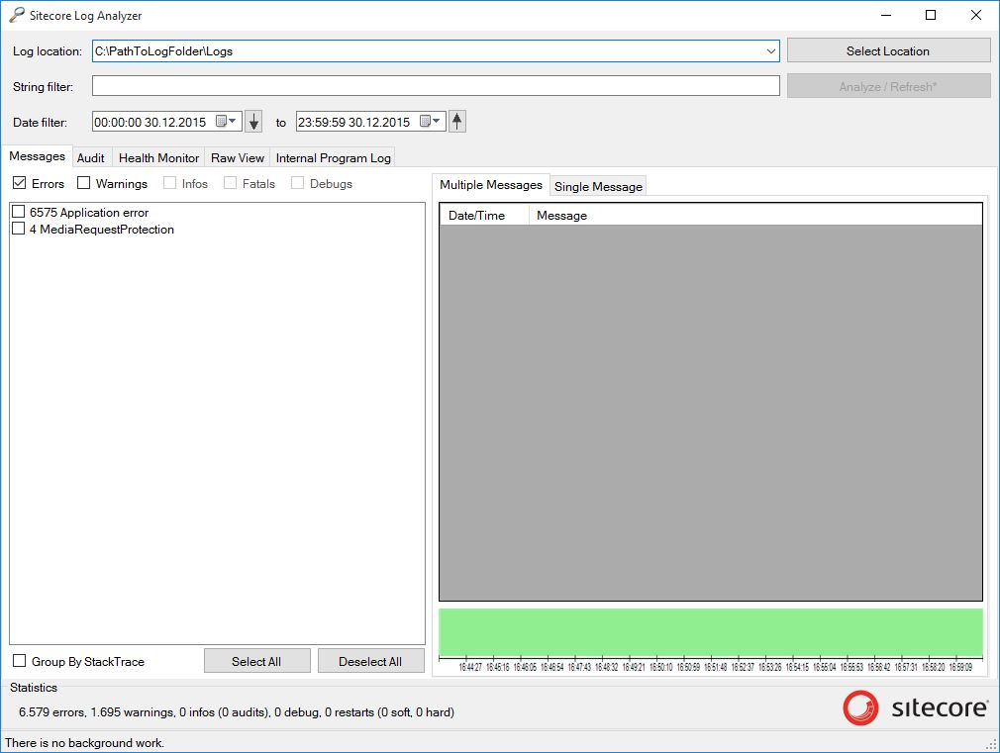

The previous post provided a [step by step guide to Sync Sitecore Logs to AWS CloudWatch Logs](/2015-12-16-sync-sitecore-logs-to-cloudwatch-logs). However,
once the log entries are in *CloudWatch Logs*, then the options for 
analysing them is very limited by the basic interface of *AWS CloudWatch 
Logs*.

The *Sitecore Log Analyzer* is a really useful tool for analysing Log files
produced by a Sitecore application. It can scan multiple log files and group 
errors by severity, monitor performance counters and get a visual overview of 
website uptime and downtime intervals.

The following Powershell script downloads log entries that are stored in 
*AWS CloudWatch Logs* and produces log files which are compatible with
the Sitecore Log Analyzer.

```powershell
Param(
  [Parameter(Mandatory=$true)][string]$LogGroupName,
  [Parameter(Mandatory=$true)][string]$LogStreamName,
  [Parameter(Mandatory=$true)][DateTime]$StartTime, #US Format
  [Parameter(Mandatory=$true)][DateTime]$EndTime, #US Format
  [Parameter(Mandatory=$true)][string]$Region,
  [Parameter(Mandatory=$true)][string]$ProfileName
)

$ErrorActionPreference = "Stop"
New-Item .\Logs -type directory -Force | Out-Null
Remove-Item .\Logs\*.txt -Force

Write-Host Getting log entries between $StartTime and $EndTime -ForegroundColor Yellow
$logEvents = Get-CWLLogEvents  -LogGroupName $LogGroupName `
                               -LogStreamName $LogStreamName `
                               -StartTime $startTime `
                               -EndTime $endTime `
                               -StartFromHead $true `
                               -ProfileName $ProfileName `
                               -Region $Region

if($logEvents.Events.Count -eq 0)
{
  Write-Host "No log entries found..." -ForegroundColor Cyan
}
else
{
  Write-Host "Downloading log files..." -ForegroundColor Green
  do
  {
    $fileName = (".\Logs\log.{0}.txt" -f $logEvents.Events[0].IngestionTime.ToString("yyyyMMdd.HHmmss"))
    $logEvents.Events | %{ ("99999 {0} {1}" -f $_.Timestamp.ToString("HH:mm:ss"), `
                             ($_.Message  -replace "[\u001C,\u0002,\u0019,\u001A]","" )) `
                        } | Out-File -Encoding ascii -Append $fileName 

    $logEvents = Get-CWLLogEvents  -LogGroupName $LogGroupName `
                                   -LogStreamName $LogStreamName `
                                   -StartTime $startTime `
                                   -EndTime $endTime `
                                   -StartFromHead $true `
                                   -ProfileName $ProfileName `
                                   -Region $Region `
                                   -nextToken $logEvents.NextForwardToken
  }
  until($logEvents.Events.Count -eq 0)
}
```

Example script usage to download log entries from the 30th December 2015:

```powershell
.\CloudWatchLogs.ps1 -LogGroupName sitecore-logs `
                     -LogStreamName i-xxxxxxxx `
                     -StartTime "12/30/2015 00:00:00" ` #US Date Format
                     -EndTime "12/31/2015 00:00:00" ` #US Date Format
                     -Region eu-west-1 `
                     -ProfileName myProfile
```

As per the AWS Powershell documentation for *Get-CWLLogEvents*, the response
has a maximum size of 1MB or 10,000 log events so multiple log files will be created 
in a subfolder called *Logs* relative to where the script is being run.

## Viewing the Logs

Once the script has finished executing, the Sitecore Log Analyzer can be used as 
normal by analysing the *Logs* folder created, e.g.



