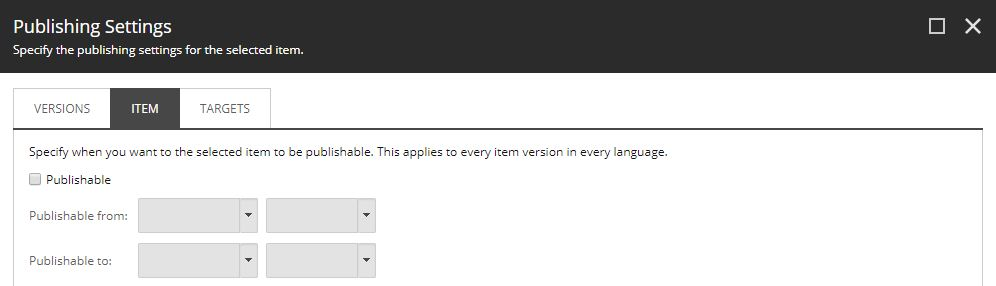

The standard way in Sitecore to prevent content being seen by users before
it's ready is to use publishing restrictions. Marking the content as unpublishable 
ensures any publishes don't push the content to the web database.



Whilst developing a new area of the site, continuous delivery will deploy partially
completed pages. To ensure the new content is hidden from users, it is marked 
as  unpublishable. The problem with this is the new content needs to be visible on test environments 
and each deployment to the test environment resets the item to unpublishable.

Having to mark the items as publishable and publish them on the test environments breaks 
the continuous delivery deployment pipeline because it introduces a manual step. Continuous 
delivery aims to have a fully automated process that you can deploy and release any version 
of the software to any environment.

The following solution allows new content to be deployed to both master and web
databases with continuous delivery but prevents public users from seeing it.

To achieve this, a *Controller Rendering* is added to a new page and returns 
404 response unless some particular criteria is matched. The example provided checks for
the existence of a known querystring:

```csharp
public class SitecoreContentFeatureToggleController : Controller
{
    private const string ToggleOverrideQueryStringKey = "SomethingNotEasyToGuess";
	
    public ActionResult Index()
    {
        if (ToggleOverridePresent())
        {
            return new EmptyResult();
        }

        return HttpNotFound();
    }

    private bool ToggleOverridePresent()
    {
        string enableToggleOverride = Request.QueryString[ToggleOverrideQueryStringKey];

        return !string.IsNullOrEmpty(enableToggleOverride) && enableToggleOverride.Equals("true");
    }
}
```

Other simple checks could be implemented instead of checking the querystring:

* Existence of a particular request header
* Existence of a particular cookie (with particular value)
* Request IP address whitelist


When making the *Controller Rendering*, it is important to ensure the rendering's caching 
fields are all unchecked. If it is marked as cacheable then the check is only applied to the first
visitor rather than to each request.

As the title suggests, this is a simple feature toggle and does not prevent 
other parts of the site from linking to the new content. For example, using this 
for news articles would not prevent the new article being picked up on the news 
landing page.

To use this approach, simply create the controller rendering and add it to the 
content item instead of marking the item as unpublishable.

## Benefits of Approach

* The deployment process for each environment is the same.
* The test team don't need to make the new content items publishable and then publish them
  on each deployment to the test environment.
* Each deployment to the UAT environment won't require the unpublishable flag removing and
  the content being published.
* If the client wants to see the new features on the live site, then they can.
* Public users receive a 404 response when they hit the URL.

## When to use this?

* When the new content is isolated - e.g. Developing a new homepage - publishing the item to a URL with the feature toggle rendering will allow authorised people to see the new page on the without the public being able to see it.

## When not to use it?

* Any new page which other pages have been set up to link to.

